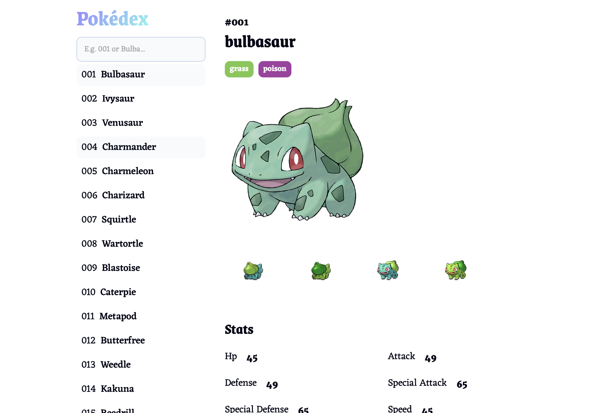

# Pokédex



## Description

Pokédex is a modern and beautifully designed application that provides detailed information about Pokémon. Built with **React.js** and styled using **FantaCSS**, it offers a seamless and responsive experience across all devices.

This application solves the problem of accessing detailed Pokémon information in an intuitive and visually appealing way. It enables users to browse Pokémon, view essential details, and explore in-depth information about their moves, all while maintaining a smooth and responsive UI. Data is fetched dynamically from **PokéAPI**, with caching implemented for optimized performance.

## Features

- **Search & Browse Pokémon**: Select a Pokémon and instantly view its information.
- **Detailed Pokémon Card**: Displays essential stats including:
  - **ID, Name, Types**
  - **High-Quality Official Image** (from `public`)
  - **Preview Images** (fetched from **PokéAPI**)
  - **State & Moves**
- **Move Details in Modal**: Click on a move to see more details in a modal window.
- **Light & Dark Mode**: Automatically adjusts to the user's system preference.
- **Responsive UI**:
  - **Mobile:** Full-screen menu with a burger button for navigation.
  - **Tablet & Desktop:** Always-visible sidebar menu for easy access.
- **Efficient API Integration**:
  - Fetches Pokémon details from **PokéAPI**.
  - Performs separate queries for each move to retrieve in-depth data.
  - Implements caching to enhance performance.
- **Modern, High-Quality Codebase**: Clean and maintainable React.js code.

## Demo

Check out the project live at: [Pokédex Demo](https://best-pokedex.vercel.app)

## Technologies

The project is built using:

- **Vite** – Fast and modern frontend tooling.
- **React.js** – Component-based UI framework.
- **FantaCSS** – Pre-styled CSS framework for a sleek and modern design.
- **JavaScript (ES6+)** – Leveraging modern JS features.
- **HTML5 & CSS3** – Structuring and styling the application.
- **PokéAPI** – Fetching real-time Pokémon data.

## Installation & Setup

To run this project locally, follow these steps:

1. Clone the repository:
   ```bash
   git clone https://github.com/LachorJohnny/pokedex.git
   cd pokedex
   ```
2. Install dependencies:
   ```bash
   npm install
   ```
3. Start the development server:
   ```bash
   npm run dev
   ```

## Why This Project?

Pokédex is designed to provide an immersive Pokémon browsing experience with an elegant, well-structured UI. It showcases:
- **High-quality UI/UX** using **FantaCSS**.
- **Dynamic data fetching & caching** for optimized performance.
- **Best practices in React.js development**, including modular and maintainable code.
- **Seamless responsiveness**, ensuring a smooth experience on both mobile and desktop.

This project is an excellent demonstration of integrating API-driven content with a user-friendly, modern interface, making it a valuable portfolio piece.
